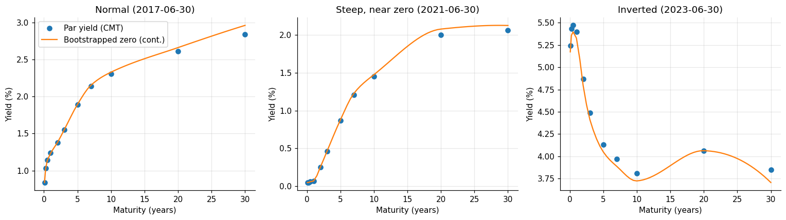
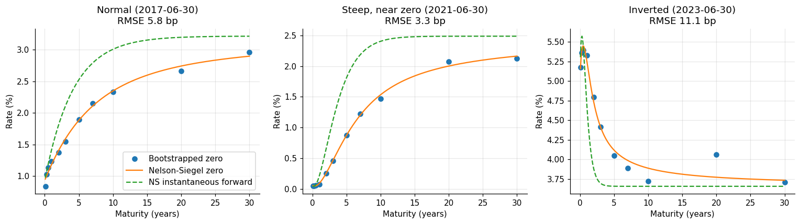
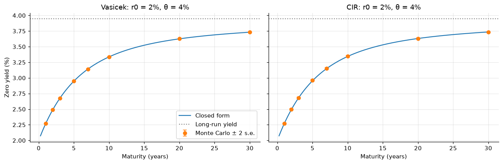
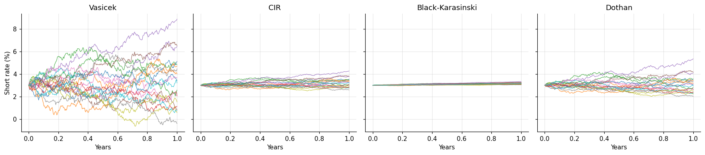
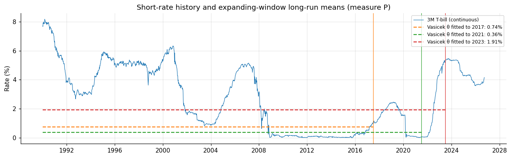
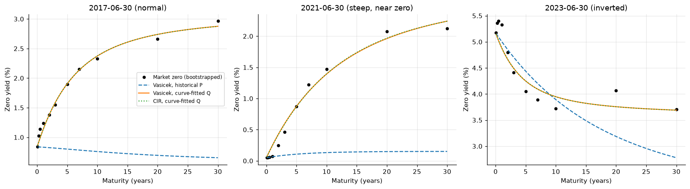
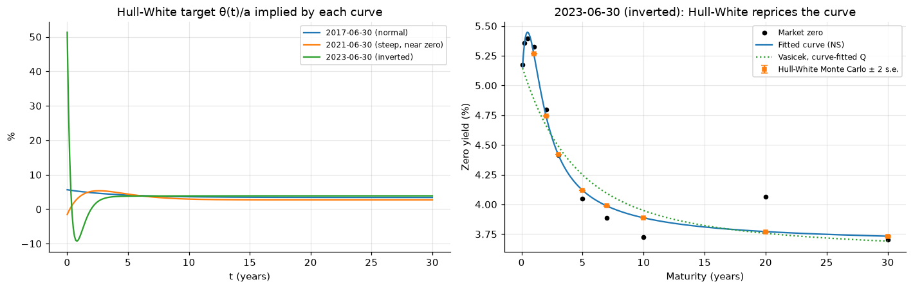

# Term-Structure Models on the US Treasury Curve

**Question.** How well do the classic one-factor short-rate models reproduce the actual US Treasury curve, and what does it take to fit it exactly?

**Data.** FRED H.15 constant-maturity Treasury yields (1M–30Y) and the 3-month T-bill, 1990 onward, on three curve shapes: normal (2017-06-30), steep near zero (2021-06-30), inverted (2023-06-30).

**Methods.** Bootstrapped zero curves and Nelson-Siegel fits. One simulator for the general one-factor SDE, checked against closed-form Vasicek/CIR bond prices. Calibration under the historical measure (AR(1) and exact CIR likelihood on T-bills) and under the pricing measure (fit to each day's curve). Hull-White with θ(t) taken from the fitted forward curve.

**Results.**
| RMSE vs market zero yields (bp) | 2017 normal | 2021 steep | 2023 inverted |
|---|---|---|---|
| Vasicek, historical parameters | 120.1 | 101.7 | 45.1 |
| CIR, historical parameters | 100.4 | 66.3 | 49.1 |
| Vasicek, drift fitted to curve | 7.5 | 11.2 | 24.4 |
| CIR, drift fitted to curve | 7.5 | 10.9 | 24.4 |
| Hull-White | 5.8 | 3.3 | 11.1 |

- Historical parameters don't price the curve. The curve-implied long-run rate is **1.7–2.6 percentage points** above the historical estimate, which is the market price of interest-rate risk.
- Time-homogeneous one-factor models fit normal curves to within about 8 bp but miss humped and inverted curves.
- Hull-White reprices the fitted curve exactly (Monte Carlo within 0.5 bp). Its remaining error is the Nelson-Siegel fit itself, driven in 2023 by the cheap 20-year bond.
- Mean reversion is weakly identified: half-life ≈ 6 years with a standard error of about half of κ, and 10-year windows range from a 0.5-year half-life to no mean reversion at all.

The full analysis, with every figure and table, is in **[notebooks/term_structure.ipynb](notebooks/term_structure.ipynb)**.

## How to run

```bash
pip install -r requirements.txt
pytest                                # 26 tests: closed forms, calibration recovery, Monte Carlo agreement
jupyter notebook notebooks/term_structure.ipynb
```

Data is cached in `data/`, so everything runs offline. `python scripts/fetch_data.py` refreshes it from FRED (no API key), and `python scripts/make_figures.py` re-executes the notebook and regenerates `figures/`.

```
termstructure/        importable package, no side effects
  data.py             FRED download and cache
  curves.py           bootstrapping, Nelson-Siegel, forward curves
  short_rate.py       general one-factor SDE simulator, Monte Carlo bond prices
  affine.py           Vasicek and CIR closed forms and exact transitions
  calibrate.py        historical (P) and curve (Q) calibration
  hull_white.py       Hull-White fitted to the initial curve
notebooks/            the analysis
tests/                pytest suite, run in CI
data/  figures/  scripts/
```

---

## Background

For this project I wanted to work with term structures of interest rates and the methods, tools, and processes I had seen used in research publications.

My primary reference was Chapter 7 of *Dynamic Asset Pricing Theory* by Darrell Duffie, "Term-Structure Models", which I found interesting for how it expands on factors from the initial models. I supplemented it with Chapter 10 of *Stochastic Calculus for Finance II* by Steven Shreve, which has the same title.

The market has a yield curve rather than a single rate. The summary below follows Section 10.1 of Shreve, which I found more informative on affine models before moving to the Heath-Jarrow-Morton framework. The two differ in focus: affine models work bottom-up, starting from short-rate dynamics that produce the yield curve, while HJM works top-down from forward rates.

## Bootstrapping and yield curves

Consider zero-coupon bonds paying 1 at maturity, with prices $B(0,T_j)$ for dates $0=T_0 < T_1 < T_2 < \dots < T_n$. A coupon bond pays fixed amounts $C_1, C_2, \dots, C_j$ at those dates, the last including the principal, so its price at time zero is

$$\sum_{i=1}^j C_i\, B(0,T_i).$$

Given coupon-bond prices, we can solve recursively for zero-coupon prices: the bond maturing at $T_1$ gives $B(0,T_1)$, the bond maturing at $T_2$ then gives $B(0,T_2)$, and so on up to $T_n$. This is *bootstrapping* zero-coupon prices from coupon-paying bond prices.

With continuous compounding, the zero-coupon price and yield are related by

$$\text{price of zero-coupon bond} = \text{face value} \times e^{-\text{yield} \times t_{\text{maturity}}}.$$

The market therefore has a curve of yields rather than a single rate, which we can think of as an interpolation of finitely many observed maturity-yield pairs. The *short rate* is idealised as the yield at the shortest maturity, or the overnight rate.

> **In the code** (`curves.bootstrap_zeros`, `curves.fit_nelson_siegel`). Treasury CMT yields are par yields, so each discount factor on the semiannual coupon grid solves the par-bond condition $\tfrac{c_n}{2}\sum_{i<n}B(0,T_i) + (1+\tfrac{c_n}{2})B(0,T_n) = 1$. Par yields between quoted maturities are interpolated monotonically (PCHIP), because a natural cubic spline overshoots between 10y, 20y and 30y and invents humps. A Nelson-Siegel curve is then fitted to the zeros (grid search on λ, linear least squares for the betas), giving a smooth, differentiable forward curve. Fit errors are 3–11 bp.
>
> 
> 

## Term structure

Set up a probability space $(\Omega,\mathscr{F},P)$ with a filtration $\mathbb{F} = \{\mathscr{F}_t : 0 \le t \le T\}$ generated by a standard Brownian motion $B$ in $\mathbb{R}^d$, $d \ge 1$.

The short rate $r$ satisfies $\int_0^T |r_t|\,dt < \infty$. Investing one unit at time $t$ and continually reinvesting at the short rate gives $e^{\int_t^s r_u\,du}$ at time $s$.

Assuming no arbitrage, there is a probability measure $Q$ under which a security paying a lump sum $Z$ at $s$ has time-$t$ price

$$E_t^{Q}\left[e^{-\int_t^s r_u\,du}\, Z\right],$$

where $E_t^Q$ is the $\mathscr{F}_t$-conditional expectation under $Q$ and $Z$ is $\mathscr{F}_s$-measurable. Setting $Z=1$, the price at $t$ of the zero-coupon bond maturing at $s$ is

$$\Lambda_{t,s} \equiv E_t^{Q}\left[e^{-\int_t^s r_u\,du}\right].$$

This is the discount function, or *the term structure of interest rates*. It is usually quoted as a yield curve, with continuously compounded yield

$$y_{t,\tau} = -\frac{\log \Lambda_{t,t+\tau}}{\tau},$$

or equivalently in terms of forward rates. In the models below the short rate is driven by a Brownian motion under $Q$, obtained from Girsanov's theorem.

> **In the code** (`short_rate.mc_bond_price`). The expectation is estimated by Monte Carlo over simulated short-rate paths and compared with the closed-form Vasicek and CIR prices. Out to 30 years they agree within 1.6 standard errors at every maturity (under 1 bp in yield).
>
> 

## One-factor term-structure models

$$dr_t = \mu(r_t, t)\,dt + \sigma(r_t, t)\,dB_t^{Q}$$

The short rate is the only factor the yield curve depends on, so bond prices can be written $\Lambda_{t,s} = F(t,s,r_t)$ for a fixed $F: [0,T] \times [0,T] \times \mathbb{R} \rightarrow \mathbb{R}$.

Each model is a special case of the SDE

$$dr_t = \left[K_0(t) + K_1(t)\,r_t + K_2(t)\,r_t \log r_t\right]dt + \left[H_0(t) + H_1(t)\,r_t\right]^v dB_t^{Q},$$

where $K_0, K_1, K_2, H_0, H_1$ are continuous functions on $[0,T]$ and the exponent $v$ ranges from 0.5 to 1.5. The Cox-Ingersoll-Ross (CIR) model has non-zero $K_0$, $K_1$ and $H_1$ with $v = 0.5$. The Pearson-Sun model is CIR plus $H_0$, with the same exponent. With $v = 1$ we have the Dothan, Merton (Ho-Lee), Vasicek and Black-Karasinski models, and $v = 1.5$ gives the Constantinides-Ingersoll model.

> **In the code** (`short_rate.OneFactorModel`). One simulator implements this SDE directly; each model is only a set of coefficients. Black-Karasinski, $d\log r = \kappa(\theta_{\log} - \log r)\,dt + \sigma\,dB$, becomes $K_1 = \kappa\theta_{\log} + \sigma^2/2$, $K_2 = -\kappa$, $H_1 = \sigma$ by Itô.
>
> Discretisation matters. For a CIR model that violates the Feller condition, Euler followed by flooring at zero (the original approach here) overstates the 10-year yield by 12.7 bp with monthly steps. Full truncation and exact noncentral-χ² sampling stay within Monte Carlo noise.
>
> 

#### $-K_1$: mean reversion

A negative $K_1$ acts as a mean-reversion parameter: high short rates produce negative drift and low short rates positive drift.

> **In the code** (`calibrate.fit_vasicek_ar1`, `calibrate.fit_cir_mle`). Vasicek's exact discretisation is an AR(1), $r_{t+\Delta} = a + b\,r_t + \varepsilon$ with $b = e^{-\kappa\Delta}$, so OLS on weekly T-bill data is the exact MLE. CIR is fitted by exact noncentral-χ² maximum likelihood. On expanding windows from 1990, κ ≈ 0.11 ± 0.06, a half-life of about 6 years. On 10-year windows the estimate is unstable, from a 0.5-year half-life (2007–17) to an explosive AR coefficient (2013–23).
>
> 

### Time-varying coefficients

Some model differences come purely from whether coefficients are constant or time-varying. For example, the Merton model of the term structure is called the Ho-Lee model when its coefficients vary with time.

## The affine class

Affine (constant-plus-linear) models have $K_2 = 0$ and $v = 0.5$. They include Vasicek ($H_1 = 0$), CIR ($H_0 = 0$), Merton/Ho-Lee ($K_1 = H_1 = 0$) and Pearson-Sun. Vasicek can equally be written with $v = 1$ and $H_0 = \sigma$. Bond prices are exponential-affine in the short rate, $\Lambda_{t,t+\tau} = A(\tau)\,e^{-B(\tau)\,r_t}$, so yields are affine in $r_t$.

### Vasicek

$$dR(t) = (\alpha - \beta R(t))\,dt + \sigma\,dW(t),$$

where $\alpha$, $\beta$ and $\sigma$ are positive constants (in the code, $\kappa = \beta$ and $\theta = \alpha/\beta$).

### Cox-Ingersoll-Ross (CIR)

$$dR(t) = (a - b R(t))\,dt + \sigma\sqrt{R(t)}\,d\widetilde{W}(t)$$

> **In the code** (`affine.Vasicek`, `affine.CIR`, `calibrate.fit_to_curve`). Model curves are compared with the market two ways: with historical parameters, and with κ and θ fitted to each day's curve. In the curve fit, σ is held at its historical value because a change of measure (Girsanov) moves only the drift. Historical parameters miss by 45–120 bp. Fitting the drift closes most of the gap, but one exponential shape cannot follow humped or inverted curves (11–24 bp).
>
> 

## Time-varying coefficients: Hull-White

$$dR(t) = (a(t) - b(t) R(t))\,dt + \sigma(t)\,d\widetilde{W}(t)$$

With constant $b$ and $\sigma$ and a time-varying target, choosing

$$\theta(t) = \frac{\partial f(0,t)}{\partial t} + b\,f(0,t) + \frac{\sigma^2}{2b}\left(1 - e^{-2bt}\right)$$

from the initial instantaneous forward curve $f(0,t)$ makes model bond prices equal today's discount curve at every maturity.

> **In the code** (`hull_white.HullWhite`). The forward curve comes from the Nelson-Siegel fit, whose derivative is available in closed form. $b$ and $\sigma$ come from the historical Vasicek fit: the dynamics come from history, the drift from today's curve. Exact simulation ($r = x + \alpha(t)$ with $x$ an OU process) reprices every curve within 0.5 bp. The cost: $\theta(t)$ contains $\partial f/\partial t$, so it amplifies any sharp bend in the fitted curve.
>
> 

## Model comparison

| Model | Distinguishing feature | Pro | Con | Here |
|---|---|---|---|---|
| Vasicek | Mean-reverting, constant volatility | Closed-form prices; exact AR(1) calibration | Allows negative rates; one curve shape | Calibrated P and Q |
| CIR | Square-root volatility | Non-negative rates (Feller) | Harder to calibrate; can't fit zero/negative bills | Exact MLE; exact simulation |
| Black-Karasinski | Lognormal short rate | Positive rates | No closed-form bond prices | Simulated |
| Hull-White | Time-dependent target θ(t) | Fits the initial curve exactly | θ(t) inherits curve-fitting noise; needs options to calibrate a, σ | Fitted to NS forward curve |
| Nelson-Siegel | Parametric yield curve | Intuitive level/slope/curvature | Not arbitrage-free dynamics | Fitted to bootstrapped zeros |

## Limitations

- Hull-White's $a$ and $\sigma$ would normally be calibrated to cap or swaption prices, which aren't freely available. Here they come from the T-bill history.
- The T-bill is a proxy for the short rate. Bills trade with a convenience yield, and CIR requires flooring the 2009–15 and 2020–21 zero-rate observations.
- CMT yields are smoothed par yields, not traded bond prices, and the curve fits are to 11 quoted maturities per day.

## Extensions

- **Two-factor models** (G2++, two-factor Hull-White) for curve shapes one factor cannot produce, such as the 2023 inversion.
- **Heath-Jarrow-Morton**: model the whole forward curve directly, with volatility functions from a PCA of curve changes.
- **PCA** of daily yield changes (level, slope, curvature) and how it shifts across regimes.
- **Diebold-Li** dynamic Nelson-Siegel forecasts against a random walk.
- **Derivatives**: calibrate Hull-White to swaptions and price bond options.

## References

- D. Duffie, *Dynamic Asset Pricing Theory*, 3rd ed., Chapter 7.
- S. Shreve, *Stochastic Calculus for Finance II: Continuous-Time Models*, Chapter 10.
- R. Lord, R. Koekkoek, D. van Dijk (2010), "A comparison of biased simulation schemes for stochastic volatility models", *Quantitative Finance*.
- F. Diebold, C. Li (2006), "Forecasting the term structure of government bond yields", *Journal of Econometrics*.
