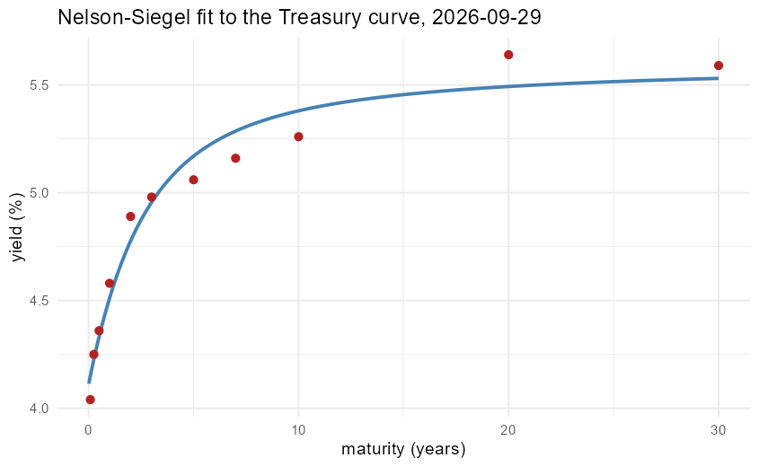

# Term Structure Modeling

[](https://github.com/vincal848/term_structure_modeling/actions/workflows/tests.yml)

This project came out of wanting to work with term structures of interest
rates and the one-factor short rate models -- Vasicek, CIR, Hull-White,
Black-Karasinski -- alongside Nelson-Siegel curve fitting, following Duffie's
*Dynamic Asset Pricing Theory* (ch. 7) and Shreve's *Stochastic Calculus for
Finance II* (ch. 10). The original notebook plotted one simulated path per
model at one fixed seed and called it done.

I have since rebuilt it. **The file labeled "Hull-White" never actually used a
time-dependent mean-reversion level** -- the one feature that defines
Hull-White and separates it from Vasicek. It set `theta <- 0.05` as a constant
inside the loop, so the chunk was Vasicek with a dead assignment. The rebuilt
Hull-White fits an arbitrary input discount curve by construction and
reproduces it to machine precision (`docs/VALIDATION.md`: diff `0.00e+00` at
five different maturities against the curve it was built from).


*Nelson-Siegel fit to the FRED par yield curve, 2026-09-29. Four parameters
fit ten points to 9.5 bp RMSE -- the curvature term lands essentially at zero
(`beta2 = -0.000001`), which is the model's honest way of saying this
particular curve doesn't have much of a hump.*

## At a glance

| | |
|---|---|
| **Methods** | Vasicek, CIR (exact noncentral chi-square transition), Hull-White (time-dependent theta(t) fit to a curve), Black-Karasinski (log-rate), Nelson-Siegel curve fitting |
| **Inputs** | Model parameters; FRED Treasury par yield curve (`data/treasury_curve.csv`, one cached date, 11 maturities) |
| **Outputs** | Vectorised short rate paths, closed-form and Monte Carlo zero-coupon bond prices, fitted Nelson-Siegel parameters |
| **Validation** | 47 tests: MC vs closed form within standard-error bands, positivity/Feller handling, exact curve reproduction, synthetic parameter recovery, invalid-input errors |
| **Headline result** | The model called "Hull-White" never used a time-varying theta(t) -- it was Vasicek by another name |
| **Stack** | R, quantmod, minpack.lm, ggplot2, testthat |

## Results

Every number below comes from [`docs/VALIDATION.md`](docs/VALIDATION.md),
regenerated by `Rscript run.R validate`.

**Short rate moments**, 20,000 paths, 2-year horizon, dt = 1/252 (Vasicek's
Euler step is exact on this grid; CIR uses the exact noncentral chi-square
transition, so both comparisons carry only Monte Carlo sampling error):

| Model | Quantity | Simulated | Closed form | diff | SE |
|---|---|---|---|---|---|
| Vasicek | E[r_T] | 0.036350 | 0.036321 | 2.86e-05 | 9.86e-05 |
| Vasicek | Var[r_T] | 1.9381e-04 | 1.9455e-04 | -7.40e-07 | - |
| CIR | E[r_T] | 0.045937 | 0.045962 | -2.50e-05 | 1.37e-04 |
| CIR | Var[r_T] | 3.7203e-04 | 3.7365e-04 | -1.62e-06 | - |

**Zero-coupon bond prices**, Monte Carlo (5,000 paths, dt = 1/52, trapezoid
integral) vs closed form:

| Model | Maturity | MC price | Closed form | diff | 3 x SE |
|---|---|---|---|---|---|
| Vasicek | 1y | 0.968374 | 0.968405 | -3.11e-05 | 3.04e-04 |
| CIR | 1y | 0.964745 | 0.964460 | 2.85e-04 | 3.89e-04 |
| Vasicek | 10y | 0.685501 | 0.685935 | -4.34e-04 | 2.36e-03 |
| CIR | 10y | 0.625350 | 0.624506 | 8.44e-04 | 2.43e-03 |

**Nelson-Siegel**, synthetic recovery (noiseless data, known beta0=0.04,
beta1=-0.015, beta2=0.01, lambda=0.6) and the cached FRED curve:

| Case | RMSE | beta0 | beta1 | beta2 | lambda |
|---|---|---|---|---|---|
| Synthetic | 3.96e-18 | 0.040000 | -0.015000 | 0.010000 | 0.600000 |
| FRED, 2026-09-29 | 0.0010 (9.5 bp) | 0.056058 | -0.014965 | -0.000001 | 0.661743 |

**Hull-White** reproduces the curve it is fit to exactly at every maturity
tested (1y, 2y, 5y, 10y, 20y: diff `0.00e+00` at each), and a 5,000-path,
5-year Monte Carlo bond price from the simulated short rate lands within
`3 x SE` of the closed form (0.771858 vs 0.772207, diff -3.49e-04, 3 x SE
1.00e-03).

## How it works

```mermaid
flowchart LR
    S[short_rate.R<br/>simulate_vasicek/cir/hw/bk] --> P[paths matrix<br/>+ times attr]
    P --> MC[mc_bond_price<br/>mean exp(-integral r dt)]
    B[bond_prices.R<br/>closed-form A,B / curve fit] --> CHK{cross-check}
    MC --> CHK
    D[data.R<br/>cached FRED curve] --> N[nelson_siegel.R<br/>fit_ns]
    D --> B
    N --> CHK
    CHK --> T[47 tests]
    CHK --> V[validate.R<br/>docs + figures]
```

**Simulation.** Every `simulate_*()` in `R/short_rate.R` is vectorised over
paths -- the loop is over time steps only, and each step updates every path
at once -- and returns a matrix with the time grid attached as
`attr(,"times")`, which is what `mc_bond_price()` needs to do the trapezoid
integral.

**Closed forms.** Vasicek and CIR are the standard affine `A(t,T)
exp(-B(t,T) r)` solutions. Hull-White's closed form is built directly from
whatever discount curve it was fit to (Brigo & Mercurio eq. 3.39), so at
`t=0` it returns that curve exactly by construction rather than approximately.

**Curve fitting.** `fit_ns()` tries `minpack.lm::nlsLM` first and falls back
to `optim()` if that fails to converge. `discount_curve_from_zero_rates()`
turns a handful of zero rates into a continuous, differentiable curve via a
natural cubic spline, which `forward_rate_from_discount()` and
`simulate_hull_white()` both differentiate numerically through the
boundary-safe `.deriv0()` helper.

## Decisions

- **Exact CIR by default, full-truncation Euler as a documented alternative.**
  The exact noncentral chi-square transition has no discretization bias and
  is non-negative by construction, which is strictly better than any Euler
  fix when it's available -- there was no reason to make the default scheme
  the one with known bias.
- **Par yields as a stand-in for continuously-compounded zero rates.** FRED
  publishes par (constant-maturity Treasury) yields, not zero rates. Treating
  them as zero rates is the standard simplification for an illustrative
  single-date curve; it is also why `fit_ns`'s RMSE on the FRED curve (9.5
  bp) isn't driven to the synthetic case's `1e-18` -- some of that gap is real
  par/zero divergence at the long end, not fitting error.
  `treasury_curve_as_zero_rates()` names this explicitly rather than hiding
  it.
  - **Trapezoid rule for the Monte Carlo bond price integral**, rather than a
  left- or right-Riemann sum, because it's exact for a piecewise-linear short
  rate path (which is what Euler simulation produces) and costs nothing extra
  over a simpler sum.
- **One plotting library.** ggplot2 for every figure, in `R/validate.R` and
  in the Rmd, rather than mixing it with base graphics the way the original
  mixed unused imports with base `plot()`.
- **`html_document`, not `pdf_document`.** The original required a working
  LaTeX install just to see a comparison table. Moving the derivations to
  `docs/THEORY.md` and rendering the notebook to HTML means `kableExtra`
  tables and `ggplot2` figures render anywhere `pandoc` is available, with no
  LaTeX dependency.

## Quick start

```r
install.packages(c("minpack.lm", "quantmod", "xts", "zoo", "ggplot2",
                    "testthat", "knitr", "kableExtra", "rmarkdown"))
```

```bash
Rscript run.R simulate --model vasicek --r0 0.03 --a 0.5 --b 0.04 --sigma 0.015 --T 1 --dt 0.0039682539683 --paths 1000 --seed 1
Rscript run.R bonds --model cir --r0 0.03 --a 0.8 --b 0.05 --sigma 0.12 --T 5 --paths 5000 --seed 1
Rscript run.R fit-ns --fred
Rscript run.R validate
```

```
vasicek: 252 steps x 1000 paths, terminal rate mean 0.033738 sd 0.011850
cir bond, T=5, 5000 paths: MC 0.799960 (SE 6.27e-04) vs closed form 0.799368, diff 5.92e-04
beta0=0.056058 beta1=-0.014965 beta2=-0.000001 lambda=0.661743  RMSE=0.000950 (nlsLM)
```

(`--dt` needs enough decimal digits that `T / dt` lands within 1e-4 of an
integer step count -- `simulate --model vasicek --T 1 --dt 0.003` is refused
for exactly this reason.)

Reproduce the documentation:

```bash
Rscript -e 'testthat::test_dir("tests/testthat")'   # 47 tests
Rscript run.R validate                               # regenerates docs/VALIDATION.md and docs/img/
```

## Repository guide

| Path | Contents |
|---|---|
| `R/short_rate.R` | `simulate_vasicek`, `simulate_cir`, `simulate_hull_white`, `simulate_bk`, `feller_condition` |
| `R/bond_prices.R` | `vasicek_bond_price`, `cir_bond_price`, `hull_white_bond_price`, `discount_curve_from_zero_rates`, `forward_rate_from_discount`, `mc_bond_price` |
| `R/nelson_siegel.R` | `nelson_siegel`, `nelson_siegel_svensson`, `fit_ns` |
| `R/data.R` | `load_treasury_curve`, `fetch_treasury_curve`, `treasury_curve_as_zero_rates` |
| `R/validate.R` | `run_validate()`, called by `run.R validate` |
| `run.R` | CLI: `simulate`, `bonds`, `fit-ns`, `validate` |
| `Term_Structure_Discussions.Rmd` | Narrative notebook, sources `R/`, knits to HTML |
| `tests/testthat/` | 47 tests |
| `docs/THEORY.md` | Bootstrapping, the risk-neutral discount formula, the affine SDE family |
| `docs/VALIDATION.md` | Full tables: moments, bond prices, curve fits (generated) |
| `data/treasury_curve.csv` | Cached FRED Treasury par yield curve, one date, 11 maturities |
| `legacy/Term_Structure_Discussions_original.Rmd` | The original notebook, annotated with defects and the tests that pin each fix |

## Future interests

- **Two-factor models** -- Longstaff-Schwartz or a two-factor Hull-White, so
  the curve can change shape rather than only shift, which no one-factor
  model here can do (every maturity is driven by the same Brownian motion).
- **The HJM framework directly**, specifying forward-rate volatility rather
  than deriving the curve from a short rate model.
- **Svensson's second hump term**, already stubbed as
  `nelson_siegel_svensson()`, compared against Nelson-Siegel on curves that
  actually have two humps.
- **A curve history** rather than one cached date, to see how the fitted
  Nelson-Siegel parameters move through time.

## Notes

- `data/treasury_curve.csv` is one date (2026-09-29 at the time it was cached)
  across the eleven maturities FRED's Treasury Constant Maturity series
  publishes. `load_treasury_curve(refresh = TRUE)` re-fetches it and requires
  network access; no test or CI run does this.
- Par yields, not zero yields -- see Decisions above.
- Timings are not reported; nothing here is slow enough on a single date's
  curve or a few thousand paths to be worth benchmarking.
